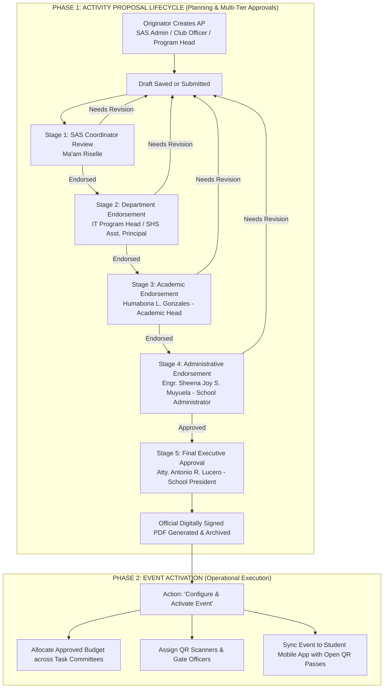

# STI Sync - Complete Activity Proposal (AP) System, Multi-Tier RBAC & Digital Signature Master Plan

> **System:** STI Sync Web & Mobile Integrated Platform  
> **Module:** Institutional Activity Proposal (AP), Dynamic Approval Routing, Electronic Signature & Event Activation  
> **Reference Documents:** `AP IT Expert Talk 1.docx`, `AP2025 (1).docx`, `AP EVRAA.docx` (`C:\VSCODE PROJECTS\STI SYNC WEB AND MOBILE\docs`)  
> **Status:** Master Plan & Phased Implementation Blueprint

---

## Table of Contents
1. [Core Paradigm Shift & Institutional Philosophy](#1-core-paradigm-shift--institutional-philosophy)
2. [Document Structure Breakdown (STI Activity Proposal)](#2-document-structure-breakdown-sti-activity-proposal)
3. [Maintenance vs. Non-Maintenance Matrix](#3-maintenance-vs-non-maintenance-matrix)
4. [Multi-Tier RBAC & Signatory User Roles](#4-multi-tier-rbac--signatory-user-roles)
5. [Audience-Driven Dynamic Approval Routing Matrix](#5-audience-driven-dynamic-approval-routing-matrix)
6. [Digital Signature Studio & Drag-and-Drop Signing Engine](#6-digital-signature-studio--drag-and-drop-signing-engine)
7. [Granular Review, Section-Specific Remarks & Return Loop](#7-granular-review-section-specific-remarks--return-loop)
8. [Validation Engine & Institutional Policy Rules](#8-validation-engine--institutional-policy-rules)
9. [Pixel-Perfect PDF Generation Engine](#9-pixel-perfect-pdf-generation-engine)
10. [Post-Approval Event Configuration & Activation](#10-post-approval-event-configuration--activation)
11. [Firestore Data Models & Schemas](#11-firestore-data-models--schemas)
12. [Master Phased Implementation Plan](#12-master-phased-implementation-plan)

---

## 1. Core Paradigm Shift & Institutional Philosophy

### A. Phase 1: Pure Proposal & Institutional Vetting (Zero Financial Gatekeeping)
In real-world STI operations, **SAS (Student Affairs & Services) does not hold independent bank balances, collect cash gate fees, or run commercial transactions.**
- **Locked QR for unpaid fees is completely removed** from all SAS events.
- All campus initiatives begin strictly as an **Activity Proposal (AP)**.
- Budgets in an Activity Proposal are **institutional funding requests** submitted to the school administration, not student payables.
- Zero financial deductions occur during proposal submission or review.

### B. Phase 2: Post-Approval Event Activation
Only after an Activity Proposal completes its full approval sequence and receives the final signature of the **School President**, the proposal is unlocked for **Event Configuration & Activation**:
- Approved funds are allocated to specific task committees.
- Multi-session dates and campus rooms are formally booked.
- Mobile gate scanner officers are designated.
- The event is published to the Student Mobile App with instant, unlocked QR entry passes.



---

## 2. Document Structure Breakdown (STI Activity Proposal)

Extracted verbatim from the official STI documents (`AP IT Expert Talk 1.docx` and `AP2025 (1).docx`):

| Section | Field Name | Type / UI Component | Behavior & Notes |
| :--- | :--- | :--- | :--- |
| **Meta** | **Date** | Auto-calculated Date | Populated with current date (e.g., `September 9, 2026`). Editable display format. |
| **Notice** | **15-Day Policy Banner** | Informational Notice | *"Note: This proposal must be submitted to the Administrator at least 15 calendar days before the start of the initial task."* |
| **1** | **Activity title** | Text Input | Formal title (e.g., *IT Expert Talk #1: Cybersecurity Awareness and Ethical Hacking*). |
| **2** | **Description** | Multiline Textarea | Detailed rationale, session tracks, target outcomes, and scope. |
| **3** | **Organizer/s** | Multi-chip / Input | Organizers (e.g., *IT Department and IT Guild Club* or *Student Affairs & Services*). |
| **4** | **Objective/s** | Dynamic List | Numbered list with `[+ Add Objective]` button. Reorderable and deletable. |
| **5** | **Success indicator/s** | Dynamic List | Numbered list with `[+ Add Success Indicator]` button. |
| **6** | **Mechanics** | Dynamic Step List | Chronological workshop or event procedures with `[+ Add Step / Procedure]`. |
| **7** | **Materials** | Dynamic Tags | Itemized list with `[+ Add Material]` (Common presets + custom input). |
| **8** | **Target market** | Target Audience Filter | Integrated with STI Academic Filter: SHS Strands, College Programs, Year Levels, Faculty. |
| **9** | **Est. attendance** | Text Input / Range | Participant projection (e.g., `150–250 Participants` or `30 students`). |
| **10** | **Marketing plan** | Dynamic List | Strategies with `[+ Add Strategy]` (FB page posts, posters, classroom visits, memos). |
| **11** | **Documentation** | Dynamic Checklist | Required records with `[+ Add Documentation]` (Attendance, Photos/Videos, Completion Report). |
| **12** | **Date & time (and Venue)** | Sessions Scheduler | Multi-session manager: Session Title, Date, Start Time, End Time, Campus Venue. |
| **13** | **Task list** | Dynamic Table | 3-column chronological grid: `Task` \| `Person Assigned` \| `Date to be Completed`. `[+ Add Task]` |
| **14** | **Financial projections** | Formal 6-Column Table | `Description` \| `Last Year Actual Budget` \| `This Year Proposed Budget` \| `Total Amount` \| `Adjustment` \| `Remarks`. Auto-calculates Revenues, Expenses, Balance. |
| **15** | **Signatories** | Formal Sign-off Grid | `Proposed by:` (Originator) \| `Endorsed by:` (Reviewers) \| `Approved by:` (President). |

---

## 3. Maintenance vs. Non-Maintenance Matrix

| Category | Item Name | Maintenance Location | Why It Requires Maintenance |
| :--- | :--- | :--- | :--- |
| **Maintained** | **Signatory Registry** | Admin Settings > Signatories | Campus coordinators, department heads, and school presidents change across school years. Must be updated in one central screen without modifying source code. |
| **Maintained** | **Campus Venues & Rooms** | Admin Settings > Venues | AVR, Gymnasium, Multi-Purpose Hall, Computer Labs, New Rooms, Classrooms. |
| **Maintained** | **Academic Tracks & Programs** | Admin Settings > Academic | Senior High Strands (STEM, ABM, HUMSS, TVL), College Programs (BSIT, BSHM, etc.), Year Levels. |
| **Maintained** | **Materials Presets Bank** | Admin Settings > Materials Presets | Suggestion list (Projectors, Sound System, Microphones, Certificates, Speaker Tokens) to speed up input. |
| **Maintained** | **Documentation Presets Bank**| Admin Settings > Doc Presets | Standard items (Attendance Sheets, Evaluation Forms, Photo/Video Documentation, Completion Report). |
| **Non-Maintained**| **Proposal Specifics** | Dynamic Wizard Form | Title, Description, unique Objectives, custom Mechanics, dynamic Task List, line-by-line Financial Projections. |

---

## 4. Multi-Tier RBAC & Signatory User Roles

### Login Portal Isolation & Account Provisioning
1. **Admin Login Portal (`/admin/login`)**:
   - **STRICTLY EXCLUSIVE TO SAS ADMIN** (e.g., *Ma'am Riselle / SAO Head*). Only accounts in `sas_admins` can authenticate here. All other users are blocked.
2. **Officer & Institutional Portal Login (`/officer/login`)**:
   - The **Universal Entryway for ALL other roles**: Club Officers, Club Advisers, Department Heads, SHS Assistant Principal, Academic Head, School Administrator, and School President.
   - Upon logging in at `/officer/login`, the system checks their role and executes **Dynamic Role Redirection**:
     - Officers & Advisers $\rightarrow$ Redirect to `/officer/dashboard`.
     - Institutional Signatories (Program Heads, Principals, Deans, President) $\rightarrow$ Redirect to `/signatory/endorsements`.
3. **Admin-Managed Account Provisioning (No Self-Registration)**:
   - SAS Admin creates signatory accounts in Admin Settings under **"Institutional Signatories Registry"**.
   - The system automatically generates a temporary password, creates the Firebase Auth account, and emails them their login credentials and portal link via EmailJS / Resend (identical to the Club Adviser flow).

### Role Directory in Central System

| Role Identifier | Designated Officer | Responsibilities & System Permissions |
| :--- | :--- | :--- |
| `sas_admin` / `sas_coordinator` | **Ma'am Riselle**<br/>*(SAS Coordinator)* | • Creates SAS institutional proposals.<br/>• First-level gatekeeper for Student Organization proposals.<br/>• Configures and validates the dynamic approval chain based on proposal scope.<br/>• Activates events after final presidential approval. |
| `program_head` | **Department / Program Heads**<br/>*(e.g., Rona Mira B. Lucañas - IT Head)* | • Reviews proposals targeting students in their department (e.g., BSIT, ACT).<br/>• Dedicated dashboard: *"Proposals Pending My Endorsement"*.<br/>• Affixes official e-signature or returns with section-specific remarks. |
| `shs_principal` | **SHS Assistant Principal**<br/>*(Cybele T. Nodalo)* | • Reviews proposals targeting Senior High School students (Grades 11 & 12).<br/>• Endorsement queue, e-signing, and section-level feedback. |
| `academic_head` | **Academic Head**<br/>*(Humabona L. Gonzales)* | • Institutional academic endorsement for college programs, inter-department seminars, and academic calendar coordination.<br/>• E-signing and revision return. |
| `school_administrator` | **School Administrator**<br/>*(Engr. Sheena Joy S. Muyuela)* | • Operational, physical plant, facility reservation, and budget review endorsement.<br/>• E-signing and revision return. |
| `school_president` | **School President**<br/>*(Atty. Antonio R. Lucero)* | • **Final Executive Approval Authority**.<br/>• Digital signature transitions proposal to `approved_president` and authorizes campus budget release. |
| `officer` | **Club / Organization Officer** | • Creates proposals on behalf of their student club.<br/>• Revises proposals returned by reviewers. |
| `student` | **General Enrolled Student** | • Mobile app user; views active events and scans entry QR tickets. |

---

## 5. Audience-Driven Dynamic Approval Routing Matrix

When an Activity Proposal is prepared, the system evaluates the **Target Market / Audience** and automatically constructs the required approval sequence:

```
[Proposal Submitted]
         │
         ▼
[Stage 1: SAS Review] ──────> Ma'am Riselle (SAS Coordinator) 
         │
         ▼
[Stage 2: Target Audience Evaluation]
   ├── If Target includes BSIT / ACT       ──────> Add: Rona Mira B. Lucañas (IT Program Head)
   ├── If Target includes Senior High      ──────> Add: Cybele T. Nodalo (SHS Asst. Principal)
   └── If Target includes Other College    ──────> Add: Respective Program Head
         │
         ▼
[Stage 3: Academic Endorsement]    ──────> Humabona L. Gonzales (Academic Head)
         │
         ▼
[Stage 4: Administrative Review]   ──────> Engr. Sheena Joy S. Muyuela (School Administrator)
         │
         ▼
[Stage 5: Final Presidential Sign] ──────> Atty. Antonio R. Lucero (School President)
         │
         ▼
[Status: APPROVED_PRESIDENT] (Unlocks Event Activation)
```

*Note: SAS Coordinator (Ma'am Riselle) retains administrative discretion to manually insert additional specialized reviewers (e.g., Guidance Counselor, Clinic/Safety Officer) before forwarding.*

---

## 6. Digital Signature Studio & Drag-and-Drop Signing Engine

### A. Digital Signature Creation Studio (User Profile / Settings)
Every authorized signatory has a **Digital Signature Profile**:
1. **Live Vector Drawing Canvas**: Responsive HTML5 vector canvas with adjustable pen thickness, smoothing algorithm, and ink color (midnight blue or formal black).
2. **Transparent PNG Upload**: Signatories can upload a high-resolution scan of their signature. An automatic background removal utility converts white background pixels to transparent PNG.
3. Securely saved to Firebase Storage at `signatures/{userId}/official_signature.png` and linked in `users/{userId}.signatureUrl`.

### B. Drag-and-Drop Document Signing
When an authorized user reviews an Activity Proposal:
1. The proposal displays in **Interactive Document Preview Mode** (formatted exactly like the STI Word template).
2. A prominent floating dock displays the user's verified digital signature.
3. The user can **drag and drop** their signature directly onto their assigned signature box in the document (or click `Affix Signature` for auto-placement).
4. The system records:
   - `signerUid`, `signerName`, `signerRole`
   - `signedAt` timestamp (e.g., `September 28, 2026 at 10:45 AM`)
   - `x`, `y` coordinates and scale factor for rendering on PDF exports.
   - An immutable audit trail entry.

---

## 7. Granular Review, Section-Specific Remarks & Return Loop

Signatories are never forced into an "all-or-nothing" decision. If an item needs correction:
1. **Section-Specific Inline Feedback**:
   - Reviewers can click any section of the proposal (e.g., *Objectives*, *Session 2 Timing*, *Financial Projections - Line Item 4*) and type targeted remarks:
     - *"Please reduce Speaker Token from P2,500 to P2,000 to comply with department budget caps."*
     - *"Computer Lab 2 is under maintenance on Oct 13. Please reschedule to Lab 1."*
2. **Proposal Return Flow**:
   - Status transitions to `returned_for_revision`.
   - The originator receives an instant notification with the full breakdown of flagged remarks.
   - The form unlocks for editing, with flagged sections visually highlighted in amber.
   - Once modified, the originator clicks **"Resubmit Revised Proposal"**, routing it directly back to the reviewer who requested changes.

---

## 8. Validation Engine & Institutional Policy Rules

1. **STI 15-Calendar-Day Rule**:
   - Formula: `earliestTaskDate - submissionDate >= 15 days`.
   - If violated: The system displays an Amber Warning modal requiring an **Urgent Submission Justification Note** before allowing submission.
2. **Financial Math & Balance Integrity**:
   - `Total Proposed Revenue` = Sum of all revenue line items.
   - `Total Proposed Expenses` = Sum of all expense line items.
   - `Balance` = `Total Revenue - Total Expenses` (automatically calculated, never manually overridden).
   - Negative amounts and blank descriptions are strictly blocked.
3. **Mandatory Field Guards**:
   - Minimum 1 Objective.
   - Minimum 1 Success Indicator.
   - Minimum 1 Mechanic / Workshop Procedure.
   - Minimum 1 Scheduled Session with Date and Venue.
   - Minimum 1 Task with Assigned Person and Target Date.
   - Valid Target Audience selection and non-empty Estimated Attendance.

---

## 9. Pixel-Perfect PDF Generation Engine

The system uses `jspdf` and `html2canvas` (already present in the repository) to export official documents:
1. **Geometry & Typography**: Standard Letter/A4 format, 1-inch margins, Arial/Helvetica formal typeface, dark blue title styling.
2. **Institutional Header**: Official STI College Ormoc logo and "ACTIVITY PROPOSAL" title banner.
3. **Structured 2-Column Key-Value Layout**: Sections 1 through 11 formatted identically to `AP IT Expert Talk 1.docx`.
4. **Formal Tabular Sections**:
   - Section 13: 3-column chronological task grid.
   - Section 14: 6-column formal financial projections table.
5. **Verified Signatures Block**: 3-column signature footer displaying the names, positions, and affixed digital signature images of all endorsing parties.
6. **Mandatory Policy Footnote**: Printed at the bottom: *"Note: This proposal must be submitted to the Administrator at least 15 calendar days before the start of the initial task."*

---

## 10. Post-Approval Event Configuration & Activation

Once `overallStatus === 'approved_president'`:
1. In the Admin Web, the proposal card unlocks a prominent **"Configure & Activate Event"** button.
2. Clicking this button opens the **Event Activation Modal**:
   - Approved fields (Title, Description, Dates, Venues, Target Audience) are locked and carried over automatically.
   - The admin configures:
     * **Operational Task Budget**: Slices the approved institutional budget across committees.
     * **Mobile QR Gate Passes**: Generates unrestricted, free entry QR tickets for all targeted students.
     * **Scanner Assignment**: Selects student officers for mobile camera scanning during event sessions.
3. The event publishes live to the **Student Mobile App**.

---

## 11. Firestore Data Models & Schemas

### A. Collection: `users`
```typescript
interface UserProfile {
  uid: string;
  email: string;
  fullName: string;
  role: 'sas_admin' | 'program_head' | 'shs_principal' | 'academic_head' | 'school_administrator' | 'school_president' | 'officer' | 'student';
  department?: string; // e.g. "Information Technology", "Senior High School"
  positionTitle: string; // e.g. "IT Program Head", "School Administrator"
  signatureUrl?: string; // Transparent PNG URL
  signatureUpdatedAt?: Timestamp;
}
```

### B. Collection: `activity_proposals`
```typescript
interface ActivityProposalDocument {
  id: string;
  referenceNo: string; // e.g., "AP-2026-IT-001"
  submissionDate: string; // "October 13, 2026"
  createdAt: Timestamp;
  createdByUid: string;
  createdByName: string;
  
  // Document Core Fields
  title: string;
  description: string;
  organizers: string[];
  objectives: string[];
  successIndicators: string[];
  mechanics: string[];
  materials: string[];
  targetAudience: {
    academicLevels: ('SHS' | 'College')[];
    departments: string[];
    yearLevels: number[];
  };
  estimatedAttendance: string;
  marketingPlan: string[];
  documentationPlan: string[];
  sessions: {
    title: string;
    date: string;
    startTime: string;
    endTime: string;
    venueName: string;
  }[];
  tasks: {
    taskName: string;
    assignedPerson: string;
    completionDate: string;
  }[];
  financialProjections: {
    revenues: { description: string; lastYearActual: number; thisYearProposed: number; totalAmount: number; adjustment: number; remarks: string; }[];
    expenses: { description: string; lastYearActual: number; thisYearProposed: number; totalAmount: number; adjustment: number; remarks: string; }[];
    totalRevenue: number;
    totalExpenses: number;
    balance: number;
  };

  // Signatory & Approval Pipeline
  approvalChain: {
    order: number;
    role: string;
    requiredSignerUid?: string;
    requiredSignerName: string;
    requiredSignerTitle: string;
    status: 'pending' | 'endorsed' | 'approved' | 'rejected' | 'returned';
    signedAt?: Timestamp;
    signatureUrl?: string;
    signaturePlacement?: { x: number; y: number; page: number };
    remarks?: string;
  }[];
  currentApprovalStage: number;
  overallStatus: 'draft' | 'under_review' | 'returned_for_revision' | 'approved_president' | 'activated_as_event';

  // Section Specific Remarks
  sectionRemarks?: {
    sectionKey: string;
    reviewerUid: string;
    reviewerName: string;
    remarkText: string;
    createdAt: Timestamp;
  }[];
}
```

---

## 12. Master Phased Implementation Plan

### Phase 1: User Roles, Signatory Registry & Digital Signature Studio
- [ ] Extend `users` collection schema to support all institutional roles (`program_head`, `shs_principal`, `academic_head`, `school_administrator`, `school_president`).
- [ ] Add **Signatory Registry** tab in Admin Settings (manage default names and titles of institutional approvers).
- [ ] Build **Digital Signature Profile Studio** in User Settings (live HTML5 drawing canvas + transparent PNG upload).

### Phase 2: Create Activity Proposal UI & Clean Up Event Wizard
- [ ] Convert Admin "Create Event" modal into the **Create Activity Proposal Wizard**:
  - Dynamic `+ Add Objective`, `+ Add Indicator`, `+ Add Step`, `+ Add Material`, `+ Add Strategy`, `+ Add Task`.
  - Formal 6-column STI Financial Table with auto-calculating totals.
  - Complete elimination of locked QR and student payable fields for SAS.
- [ ] Implement the **STI 15-Calendar-Day Rule** validation warning.

### Phase 3: Dynamic Approval Routing & Proposal Service
- [ ] Implement `activity-proposal.service.ts` with full CRUD, draft management, and audience-based approval chain generator.
- [ ] Connect Target Audience selections (BSIT, SHS, College) to auto-assemble the required sequence of signatories.

### Phase 4: Signatory Review Portal, Drag-and-Drop Signing & Feedback Loop
- [ ] Build the **"Pending My Endorsement"** dashboard for Program Heads, Principals, Administrators, and the President.
- [ ] Build interactive document review viewer with **drag-and-drop digital signature placement**.
- [ ] Implement section-specific remarks and the **"Return for Revision"** loop.

### Phase 5: Pixel-Perfect PDF Export (Official STI Format)
- [ ] Build `ActivityProposalPdfDocument` using `jspdf` and `html2canvas` matching the 2-column layout of `AP IT Expert Talk 1.docx`.
- [ ] Include header logos, structured task grids, financial tables, and embedded digital signatures.

### Phase 6: Post-Approval Event Configuration & Mobile Sync
- [ ] Implement the **"Configure & Activate Event"** modal for proposals with `status === 'approved_president'`.
- [ ] Configure task budget allocation, assign mobile QR scanners, and publish the event live to the Student Mobile App.
