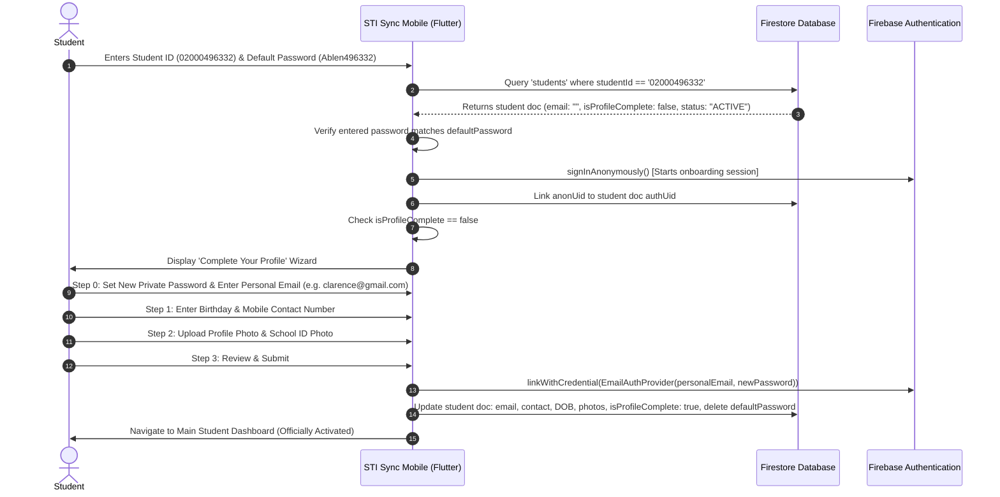

# STI SYNC — Registrar Bulk Enrollment & Mobile Authentication Specification

> **Version:** 1.0.0  
> **Status:** Approved Architecture Plan  
> **Target Systems:** STI Sync Web (SAO Admin Portal) & STI Sync Mobile (Flutter)  
> **Applicable Term:** Academic Year 2026-2027 onwards (SHS & Tertiary / Baccalaureate)

---

## 1. Executive Summary & Objective

In previous versions, student account creation was performed either manually one-by-one by the SAO Administrator or through student self-registration. This process was time-consuming, error-prone, and caused operational bottlenecks during enrollment seasons.

This specification establishes the **Automated Registrar Bulk Enrollment & Mobile Onboarding Architecture**:
1. **Bulk Enrollment via Registrar Spreadsheets:** Ingestion of official Registrar Excel spreadsheets (`SHS 2026-2027 (G11 TO G12).xlsx` and `TER 2026-2027 1ST SEM (1ST TO 4TH YR).xlsx`).
2. **Automated Promotion & Seamless Re-Enrollment:** Existing students are automatically promoted to their new Year Level, Course, and Term with zero manual re-enrollment required.
3. **Instant Mobile Credentials Formula:** Every student receives a deterministic initial password based on their Last Name and Student Number (`Caps(FirstChar)lastname + last 6 digits of student number`).
4. **First-Login Profile Completion:** Students verify their personal details, email, contact number, photos, and set their permanent private password directly on the mobile app.
5. **Auto-Provisioning of Academic Masters:** Academic courses and terms are automatically extracted and synchronized into Firestore collections (`courses`, `semesters`), while retaining administrative maintenance controls.

---

## 2. Registrar Excel File Format Specification

The registrar provides two primary enrollment lists exported per term in `C:\VSCODE PROJECTS\STI SYNC WEB AND MOBILE\docs`:
- **Senior High School (SHS):** `SHS 2026-2027 (G11 TO G12).xlsx` (412 students, 12 Program/Year blocks)
- **Tertiary / Baccalaureate (College):** `TER 2026-2027 1ST SEM (1ST TO 4TH YR).xlsx` (925 students, 14 Program/Year blocks)

### 2.1 File & Sheet Structure
- **Sheet Name:** `Career_Enrollment_List`
- The file is organized as a **multi-block hierarchical document**, where each program and year level has its own header block followed by enrolled students.

### 2.2 Header Block Layout (Repeated per Program/Year)
| Row Position | Cell Location | Label / Content Description | Example Value |
| :--- | :--- | :--- | :--- |
| **Row 1** | Col 1 (A) | Academic Level Banner | `Senior High School ENROLLMENT LIST` or `Baccalaureate ENROLLMENT LIST` |
| **Row 8** | Col 1 (A) & Col 3 (C) | School Year & Term | `School Year & Term :` `2026-2027/1st Term` |
| **Row 10** | Col 1 (A) & Col 3 (C) | Year Level | `Year Level :` `Grade 11`, `Grade 12`, `Year 1 Term 1`, etc. |
| **Row 12** | Col 1 (A) & Col 3 (C) | Course Program | `Course Program :` `ABM - ACCOUNTANCY, BUSINESS MGMT.` |
| **Row 15** | Cols 1 to 10 | Table Column Headers | See Table below |
| **Row 16+** | Cols 1 to 10 | Student Rows | Student records until next block |

### 2.3 Student Data Columns (Row 15+)
| Column Index | Excel Header | Description | Action in STI Sync Database |
| :---: | :--- | :--- | :--- |
| **Col 1** | `No.` | Sequence counter in registrar list | ❌ **EXCLUDE** (Do not save to Firestore) |
| **Col 2** | `LRN No.` | DepEd Learner Reference Number | ❌ **EXCLUDE** (Do not save to Firestore) |
| **Col 3** | *(Blank)* | Spacer column | ❌ **EXCLUDE** |
| **Col 4** | `Student No.` | Official 11-digit STI Student ID | ✅ **SAVE** as `studentId` (e.g. `02000454918`) |
| **Col 5** | `Last Name` | Student Last Name / Surname | ✅ **SAVE** as `lastName` (e.g. `ABLEN`, `ARIAS`) |
| **Col 6** | `First Name` | Student First Name | ✅ **SAVE** as `firstName` (e.g. `JHILLARY DUPHNIE`) |
| **Col 7** | *(Blank)* | Spacer column | ❌ **EXCLUDE** |
| **Col 8** | `Middle Name` | Student Middle Name | ✅ **SAVE** as `middleName` (or empty string `""` if blank) |
| **Col 9** | *(Blank)* | Spacer column | ❌ **EXCLUDE** |
| **Col 10** | `Sex` | Gender code (`M` or `F`) | ✅ **SAVE** as `sex` (`Male` for `M`, `Female` for `F`) |

---

## 3. Parsing & Normalization Rules

### 3.1 Course Program Parsing
Course programs follow the pattern: `<CourseCode> - <CourseName>`
- **Delimiter:** Split on ` - ` (space dash space) or regex `^([A-Z0-9\-]+)\s*-\s*(.+)$`.
- **Examples Extracted from Registrar Files:**
  - `ABM - ACCOUNTANCY, BUSINESS MGMT.` ➔ Code: `ABM`, Name: `ACCOUNTANCY, BUSINESS MGMT.`
  - `ACAD-BE - BUSINESS AND ENTREPRENEURSHIP` ➔ Code: `ACAD-BE`, Name: `BUSINESS AND ENTREPRENEURSHIP`
  - `ASSH - ARTS, SOCSCI & HUMANITIES` ➔ Code: `ASSH`, Name: `ARTS, SOCSCI & HUMANITIES`
  - `CUART - CULINARY ARTS` ➔ Code: `CUART`, Name: `CULINARY ARTS`
  - `HTCUA - HOSPITALITY AND TOURISM  (CA)` ➔ Code: `HTCUA`, Name: `HOSPITALITY AND TOURISM  (CA)`
  - `HTTO - HOSPITALITY AND TOURISM (TOP)` ➔ Code: `HTTO`, Name: `HOSPITALITY AND TOURISM (TOP)`
  - `HUMSS - HUMANITIES & SOCIAL SCIENCES` ➔ Code: `HUMSS`, Name: `HUMSS - HUMANITIES & SOCIAL SCIENCES`
  - `ICT - ICT SUPPORT & CPT` ➔ Code: `ICT`, Name: `ICT SUPPORT & CPT`
  - `MAWD - IT IN MOBILE APP & WEB DEV'T` ➔ Code: `MAWD`, Name: `IT IN MOBILE APP & WEB DEV'T`
  - `STEM - ENGINEERING, TECHNOLOGY & MATH` ➔ Code: `STEM`, Name: `ENGINEERING, TECHNOLOGY & MATH`
  - `TOPER - TOURISM OPERATIONS` ➔ Code: `TOPER`, Name: `TOURISM OPERATIONS`
  - `ACT - ASSOCIATE IN COMPUTER TECH.` ➔ Code: `ACT`, Name: `ASSOCIATE IN COMPUTER TECH.`
  - `BSHM - BS IN HOSPITALITY MANAGEMENT` ➔ Code: `BSHM`, Name: `BS IN HOSPITALITY MANAGEMENT`
  - `BSIT - BS IN INFORMATION TECHNOLOGY` ➔ Code: `BSIT`, Name: `BS IN INFORMATION TECHNOLOGY`
  - `BSTM - BS IN TOURISM MANAGEMENT` ➔ Code: `BSTM`, Name: `BS IN TOURISM MANAGEMENT`

### 3.2 Year Level Normalization
| Raw Excel Year Level | Target Normalized `yearLevel` | Target `academicLevel` |
| :--- | :--- | :--- |
| `Grade 11` | `Grade 11` | `SHS` |
| `Grade 12` | `Grade 12` | `SHS` |
| `Year 1 Term 1` | `1st Year` | `COLLEGE` |
| `Year 2 Term 1` | `2nd Year` | `COLLEGE` |
| `Year 3 Term 1` | `3rd Year` | `COLLEGE` |
| `Year 4 Term 1` | `4th Year` | `COLLEGE` |

### 3.3 School Year & Term Normalization
| Raw Excel String | Target `schoolYear` | Target `semester` / `term` |
| :--- | :--- | :--- |
| `2026-2027/1st Term` (Tertiary) | `2026-2027` | `1st Semester` |
| `2026-2027/1st Term` (SHS) | `2026-2027` | `1st Term` (or `1st Trimester`) |

---

## 4. Ingestion & Promotion Logic

```mermaid
flowchart TD
    Start([Upload Registrar Excel File]) --> Parse[Parse Blocks: Term, Level, Course, Students]
    Parse --> CheckCourse[Check if Course & Term exist in DB]
    CheckCourse -->|Missing| AutoProvision[Auto-provision missing Course / Semester]
    CheckCourse -->|Exists| ProcessStudent[For each Student Row]
    AutoProvision --> ProcessStudent

    ProcessStudent --> QueryDB{Student No. exists in 'students'?}
    
    QueryDB -->|YES: Existing Student| AutoPromote[Auto-Promote & Update Academic Record]
    AutoPromote --> ArchiveHist[Record previous term in enrollmentHistory]
    ArchiveHist --> UpdateCurr[Update schoolYear, term, yearLevel, courseCode]
    UpdateCurr --> ClearReenroll[Set status = ACTIVE, clear pending re-enrollment]
    
    QueryDB -->|NO: New Student| CreateNew[Create New Student Record]
    CreateNew --> GenPwd[Generate Default Password: Caps(LastName) + Last6(StudentNo)]
    GenPwd --> CreateAuth[Create Firebase Auth User]
    CreateAuth --> SaveDoc[Save to 'students' collection: isProfileComplete = false]
    
    SaveDoc --> NextStudent{More students?}
    ClearReenroll --> NextStudent
    NextStudent -->|Yes| ProcessStudent
    NextStudent -->|No| Finish([Import Summary & Audit Log])
```

### 4.1 Existing Students (Auto-Promotion)
If `studentId` matches an existing document with the same name:
1. **Preserve Identity & Credentials:** Do **NOT** overwrite user custom passwords, emails, photos, contact numbers, or auth UIDs.
2. **Promote Academic Standing:**
   - Push previous `{ schoolYear, semester, yearLevel, courseCode, section, updatedAt }` into `enrollmentHistory` array.
   - Update current `schoolYear`, `semester`, `yearLevel`, `courseCode`, `courseName`, `courseId`, `departmentId`.
   - Update `status = 'ACTIVE'`.
3. **Automate Re-Enrollment Clearance:**
   - Clear any pending re-enrollment flags (`pendingReEnrollment = false`, `lastReenrolledAt = now`).
   - The student does **not** need to go through manual re-enrollment in the mobile app because the Registrar list serves as the official clearance.
4. **Decision Option:** The admin can choose `Auto-Promote & Update` (default) or `Skip (Keep Current)`.

### 4.2 Name Collision & Conflict Validation
If `studentId` matches an existing document, but the student name differs (e.g. Existing DB: `Arias, Jhillary` vs Incoming: `Smith, John`):
- **Conflict Warning:** System flags this as an ID Collision.
- **Admin Decisions:**
  - `Skip Incoming (Safe)` (Default): Keeps existing database student untouched and skips the conflicting incoming row.
  - `Overwrite Existing DB Record`: Replaces the student record with the new incoming student from the registrar list.

### 4.3 Missing from Registrar List: Inactive Reconciliation & Graduating Cohort
When a new term's enrollment list is ingested, active students from the prior term who are **NOT present** in the new spreadsheet are detected and reconciled:
1. **Graduating Cohort (`4th Year` College or `Grade 12` Senior High):**
   - **Decision Options:**
     - `Archive as Graduated` (Default): Sets `status = 'ARCHIVED'`, `archiveReason = 'Graduated'`.
     - `Mark Inactive`: Sets `status = 'INACTIVE'`, reason: `Completed studies / Graduated`.
     - `Keep Active (Skip)`: Retains active status.
2. **Continuing Cohort (`Grade 11`, `1st Year`, `2nd Year`, `3rd Year`):**
   - **Decision Options:**
     - `Mark as Inactive (Unenrolled)` (Default): Sets `status = 'INACTIVE'`, reason: `Not present in Registrar List for [Term]`.
     - `Keep Active (Skip)`: Retains active status if on leave or manual exemption.

### 4.4 New Students (First-Time Enrollment)
If `studentId` does **not** exist in database:
1. **Generate Default Password:**
   - **Formula:** Capitalized first letter of Last Name (lowercase rest) + last 6 digits of Student Number.
   - **Examples:**
     - Student No: `02000496332`, Last Name: `ABLEN` ➔ Password: `Ablen496332`
     - Student No: `02000454918`, Last Name: `ARIAS` ➔ Password: `Arias454918`
     - Student No: `02000505336`, Last Name: `CAÑETE` ➔ Password: `Canete505336` (non-ASCII characters normalized)
     - Student No: `02000458280`, Last Name: `DE LA CRUZ` ➔ Password: `Delacruz458280` (spaces removed, title-cased)
2. **Zero Fake Emails / No Auto-Upload Email:**
   - **No placeholder/provisional email is created** (e.g. no `${studentId}@student.sti.edu`).
   - Field `email` is initialized as empty string `""`.
   - The student will upload/enter their own active personal email address directly in the mobile app during first login.
3. **Immediate Active Status (No Admin Approvals / No Pending Verification):**
   - Official registrar lists represent confirmed enrollments; therefore, students already have accounts created.
   - Student is saved with `status: "ACTIVE"`. No admin verification queue or approval steps are required.
4. **Firestore Document (`students` collection):**
   ```json
   {
     "studentId": "02000496332",
     "lastName": "ABLEN",
     "firstName": "JUAN",
     "middleName": "DELA CRUZ",
     "sex": "Male",
     "academicLevel": "COLLEGE",
     "courseId": "course_bsit_id",
     "courseCode": "BSIT",
     "courseName": "BS IN INFORMATION TECHNOLOGY",
     "departmentId": "dept_cite_id",
     "departmentName": "Information Technology Education",
     "yearLevel": "1st Year",
     "section": "UNASSIGNED",
     "schoolYear": "2026-2027",
     "semester": "1st Semester",
     "email": "",
     "authUid": "",
     "status": "ACTIVE",
     "registrationSource": "REGISTRAR_IMPORT",
     "isProfileComplete": false,
     "requiresPasswordChange": true,
     "defaultPassword": "Ablen496332",
     "profilePhotoUrl": "",
     "schoolIdPhotoUrl": "",
     "contactNumber": "",
     "dateOfBirth": "",
     "createdAt": "<Timestamp>",
     "updatedAt": "<Timestamp>"
   }
   ```

---

## 5. Mobile App (Flutter) First-Login & Email Upload Flow



### 5.1 Mobile Login Flow Details
1. **Identifier Resolution:**
   The mobile app's `AuthRepository.login(identifier, password)` detects an 11-digit Student ID.
   It queries the `students` collection by `studentId`.
2. **First-Time Login (Email is Empty):**
   - If `email` in Firestore is empty (`""`):
     - Validates entered password against `defaultPassword` (or formula `Caps(LastName) + last 6 digits of studentId`).
     - If matched, signs into an onboarding session via `signInAnonymously()` and associates the temporary `anonUid`.
     - Directs student directly into `ProfileCompletionFlowScreen`.
3. **Student Profile Completion & Email Registration:**
   - **Step 0 (Security & Credentials):** Student inputs their permanent private password and uploads/enters their real personal email (e.g. `@gmail.com`, `@yahoo.com`, `@outlook.com`).
   - **Step 1 (Personal Details):** Date of Birth and 10-digit PH Mobile Number (`9XXXXXXXXX`).
   - **Step 2 (Identity Verification):** Student uploads their Profile Photo and School ID Photo to Cloudinary.
   - **Step 3 (Final Submission):** Links the anonymous session to the permanent email/password via Firebase Auth `linkWithCredential`, updates the student document in Firestore with `email`, `isProfileComplete: true`, `requiresPasswordChange: false`, and deletes `defaultPassword`.
4. **Subsequent Logins:**
   - The student can log in using either their **Student ID** (app resolves their registered email from Firestore) OR their **Personal Email** directly, alongside their new private password.
   - Authenticates seamlessly through Firebase Auth `signInWithEmailAndPassword`.

### 5.2 No Admin Approvals Required
- Because students are pre-verified via the official Registrar enrollment lists, they do NOT require administrator approval or manual ID verification to access the mobile application.
- Once the student uploads their email and completes their profile in the mobile app, their account is instantly active and fully functional.## 6. Architecture Decision: Maintenance Screens vs Auto-Provisioning

> **Question:** *"Should I delete my semester maintenance, course, year level, and section maintenance? Should I just auto add from my system so each term or school year is updated?"*

### Recommendation: **Hybrid Model (Auto-Provisioning + Master Maintenance)**
**DO NOT delete the maintenance screens.** Instead, integrate auto-provisioning with maintenance as follows:

| Feature / Domain | Auto-Import Behavior | Why Maintenance MUST Remain |
| :--- | :--- | :--- |
| **Courses & Programs** | Auto-extracts code (`ABM`, `BSIT`) and title; creates course if missing. | Maintenance is needed to assign Courses to **Departments** (`CITE`, `SHS`), define curriculum years, and archive outdated programs. |
| **Semesters & Terms** | Detects active academic year (`2026-2027`) and term (`1st Term`). | The Registrar list **does NOT contain** `startDate`, `endDate`, `reenrollDeadline`, or rollover options. Admin must set deadlines and rollover rules in `AcademicSemesterSettings`. |
| **Sections** | Sets `section: "UNASSIGNED"` initially. | **The Registrar Excel contains NO section column!** Sections (e.g. `BSIT-1A`, `BSIT-1B`, `ABM-12B`) are internal campus designations. Admins and Officers manage sections via Section Maintenance. |
| **Year Levels** | Auto-maps `Grade 11`, `Grade 12`, `Year 1` to `4th Year`. | Configuration ensures system-wide dropdown consistency for event target audiences and fee assignments. |

---

## 7. Database Collections & Query Optimization

To fulfill fast querying and filtering across Web and Mobile:

### 7.1 `courses` Collection
```typescript
interface CourseDocument {
  id: string;               // e.g. "course_bsit"
  code: string;             // e.g. "BSIT"
  name: string;             // e.g. "BS IN INFORMATION TECHNOLOGY"
  departmentId: string;     // ref → departments
  departmentName?: string;
  academicLevel: 'COLLEGE' | 'SHS';
  yearLevels: number;       // 2 for SHS, 4 for College
  archived: boolean;
  createdAt: Timestamp;
  updatedAt: Timestamp;
}
```

### 7.2 `sections` Collection
```typescript
interface SectionDocument {
  id: string;               // e.g. "sec_bsit_1a"
  name: string;             // e.g. "BSIT-1A"
  courseId: string;         // ref → courses
  courseCode: string;       // e.g. "BSIT"
  departmentId: string;     // ref → departments
  yearLevel: number;        // 1, 2, 3, 4, 11, 12
  academicLevel: 'COLLEGE' | 'SHS';
  studentCount?: number;
  archived: boolean;
  createdAt: Timestamp;
  updatedAt: Timestamp;
}
```

### 7.3 `semesters` / `academic_periods` Collection
```typescript
interface SemesterDocument {
  id: string;               // e.g. "ay_2026_2027_1s"
  academicYear: string;     // "2026-2027"
  semester: string;         // "1st Semester" or "1st Term"
  academicLevel: 'COLLEGE' | 'SHS';
  termType: 'SEMESTER' | 'TRIMESTER';
  label: string;            // "A.Y. 2026-2027 1st Semester"
  startDate: string;        // "2026-08-15"
  endDate: string;          // "2026-12-20"
  reenrollDeadline: string; // "2026-09-01"
  status: 'ACTIVE' | 'UPCOMING' | 'COMPLETED';
  studentsCount: number;
  archived: boolean;
}
```

### 7.4 Compound Query Indexes for Fast Filtering
Create the following Firestore composite indexes for sub-millisecond filtering on mobile and web:
1. `students`: `academicLevel` (ASC) + `courseCode` (ASC) + `yearLevel` (ASC) + `status` (ASC)
2. `students`: `schoolYear` (ASC) + `semester` (ASC) + `status` (ASC)
3. `students`: `studentId` (ASC) + `status` (ASC)

---

## 8. Implementation Phases & Checklist

### Phase 1: Web Admin Bulk Upload Module (STI Sync Web) — COMPLETED
- [x] Add **"Bulk Import (Registrar)"** button & modal in `ActiveStudents.tsx`.
- [x] Implement client-side Excel parser using `xlsx` (SheetJS) supporting SHS and College files.
- [x] Auto-provision missing courses into `courses` and active term into `semesters`.
- [x] Multi-category decision matrix (Auto-promote, New Enrollees, Inactive Unenrolled, ID Collisions).
- [x] Batch Firestore commits in chunks of 400 with real-time progress bar.
- [x] Generate default credentials (`Caps(LastName) + Last 6 digits`) and exportable audit CSV.

### Phase 2: Streamlined Manual Addition & Registry Cleanup (STI Sync Web) — COMPLETED
- [x] Rebuilt `AddStudentManuallyModal.tsx` to single-step Late Enrollee Quick Add.
- [x] Captures only essential info: Student ID, Name, Sex, Academic Program, Year Level, Section.
- [x] Real-time Student ID collision validation: blocks submission if ID belongs to a different student name.
- [x] Same student recognition: allows advancing/promoting academic standing without duplicate creation.
- [x] Removed obsolete manual re-enrollment tab from `StudentRegistry.tsx`.
- [x] Default landing tab set directly to Active Students.

### Phase 3: Mobile Adaptation (STI Sync Mobile / Flutter) — READY FOR MOBILE TEAM
- [ ] Update `login_screen.dart` hint with default password formula: `Caps(LastName) + Last 6 digits of Student No.`
- [ ] Add `isProfileComplete` check inside `AuthViewModel` after successful student login.
- [ ] If `isProfileComplete == false`, route to `ProfileCompletionFlowScreen`.
- [ ] Re-use existing `registration/steps` widgets for photo, personal email, contact, and password updates.
- [ ] Update student's email and password in Firebase Auth and set `isProfileComplete = true`.

---

## 9. Frequently Asked Questions (FAQ)

### Q1: What happens if a student last name has spaces or hyphens (e.g. "DE GUZMAN" or "DELA-CRUZ")?
**Rule:** Remove all spaces and hyphens, capitalize only the first letter, and append the last 6 digits of the student number:
- `DE GUZMAN` + `02000496332` ➔ `Deguzman496332`
- `DELA-CRUZ` + `02000496332` ➔ `Delacruz496332`

### Q2: What if a student was already active and changed course (shifter)?
The system detects the existing `studentId`, archives the previous program details into `enrollmentHistory`, updates `courseCode` and `courseName` to the new program, and retains their existing password and login account.

### Q3: Why not assign sections during bulk upload?
The Registrar enrollment spreadsheets (`SHS 2026-2027 (G11 TO G12).xlsx` and `TER 2026-2027 1ST SEM (1ST TO 4TH YR).xlsx`) do not have section columns. Students will be marked `section: "UNASSIGNED"` until assigned via Section Maintenance or batch sectioning.

---

## 10. Dynamic Student Export (Rosters & Credentials)

Administrators can dynamically export student rosters and credentials directly from the Active Students directory:

### 10.1 Export Modes
1. **Official Class Roster (Clean / No Passwords):**
   - Intended for instructors, attendance check-in, and public posting.
   - Passwords are completely omitted for data privacy.
   - Columns: `No.`, `Student ID`, `Last Name`, `First Name`, `Middle Name`, `Sex`, `Program`, `Year Level`, `Section`, `Email`, `Contact Number`, `Status`, `Academic Year`, `Term`.
2. **Account Credentials Distribution Sheet (With Passwords):**
   - Intended for SAO administrators, orientation leads, and class advisers distributing default login credentials.
   - Includes calculated temporary initial passwords (`Caps(LastName) + Last 6 Digits of Student No.`).
   - Columns: `No.`, `Student ID`, `Last Name`, `First Name`, `Middle Name`, `Sex`, `Program`, `Year Level`, `Section`, `Email`, `Default Password`, `Profile Setup Status`, `Academic Year`, `Term`, `Status`.

### 10.2 Dynamic Filtering Capabilities
- **By Section:** Export all students from a specific section (e.g., `BSIT-1A`) or across all sections.
- **By Academic Program:** Filter by `BSIT`, `BSHM`, `ABM`, etc.
- **By Year Level:** Filter by `1st Year`, `Grade 11`, etc.
- **Multi-Sheet Excel Workbook:** When exporting all sections to Excel (`.xlsx`), the system can automatically group students into separate sheet tabs per section inside a single file.

---

## 11. Unified Officer Authentication Architecture

### 11.1 Principle: One Student, One Set of Credentials
Appointed student leaders (Club Presidents, Treasurers, Secretaries, Auditors, etc.) are **active enrolled students granted leadership permissions** in the `organization_officers` collection.

1. **No Separate Officer Passwords:** Advisers do not generate arbitrary dummy passwords (`TempPass123!`). The appointment record simply stores `useStudentCredentials: true`.
2. **Web Officer Portal Login (`/officer/login`):**
   - The student logs in using their **Student ID** (or registered personal email) + their **Student Password**.
   - The system checks if their `studentId` has an active record in `organization_officers`.
   - **If NOT an officer:** The system displays a clear error: *"You are officially enrolled as a student, but you do not hold an active appointed officer role in any registered organization."*
   - **If an active officer:**
     - If the student has completed mobile profile setup, it authenticates securely via Firebase Auth (`signInWithEmailAndPassword`).
     - If the student was appointed before completing mobile profile setup, it validates against their initial default formula (`Caps(LastName) + Last 6 digits of studentId`).
     - Once authenticated, unlocks the Officer Dashboard for their assigned organization.

### 11.2 Lifecycle: Automatic Deletion of `defaultPassword` in Firestore
To guarantee that plaintext initial passwords are never retained:
- **Mobile First-Login Profile Completion:** When the student enters their personal email and private password, `profile_completion_repository.dart` executes `'defaultPassword': FieldValue.delete()`.
- **Web Password Update:** When an officer or student updates their password via `password.service.ts`, `defaultPassword: deleteField()` is executed on the student document.
- Once deleted, the account is 100% secured by Firebase Authentication; neither administrators nor database readers can view the student's password.
